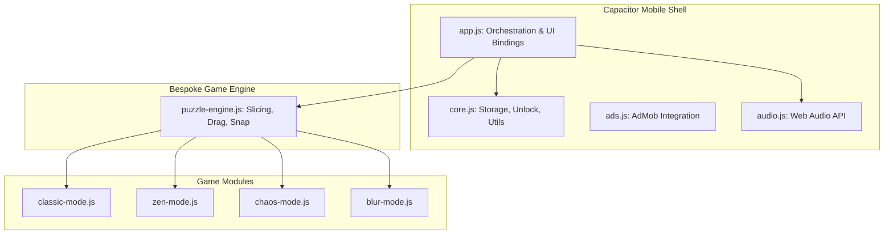

  

  <h1>PuzzleForge</h1>
  
<strong>A Premium Jigsaw Puzzle Experience for Android</strong>

  
  
  
  

---

## 📌 Executive Summary

**PuzzleForge** is a highly polished, feature-rich jigsaw puzzle game engineered for the modern Android ecosystem. Designed from the ground up to deliver a premium, tactile, and visually stunning user experience, the application challenges players with gorgeous, **hand-curated, pre-made puzzles** across multiple innovative game modes.

As a showcase of robust mobile hybrid development, PuzzleForge leverages **Capacitor** alongside a completely bespoke **Vanilla JavaScript Puzzle Engine**—eschewing heavy game engines like Unity or Godot in favor of a lightweight, highly optimized web-native core that performs flawlessly on mobile devices.

---

## 🎨 The Art Strategy: Curated, Pre-Made Excellence

*CRITICAL ARCHITECTURAL DECISION*

Unlike many generic puzzle games that rely on messy procedural image generation at runtime, **PuzzleForge exclusively utilizes a curated gallery of high-fidelity, pre-made puzzles.** 

1. **Uncompromising Quality:** Every puzzle image (from *Cyberpunk Cityscapes* to *Macro Nature*) is pre-generated using advanced AI tooling (Midjourney, DALL-E 3) and manually fed into the app during the build process.
2. **Zero Runtime Overhead:** By loading pre-made assets, the app entirely bypasses the massive battery drain and CPU spikes associated with runtime generation.
3. **Optimized Delivery:** All assets have been highly compressed (converted to 80% quality JPGs), reducing the total application footprint by 85% (from 175MB down to 25MB) without sacrificing visual fidelity.

---

## 🚀 Core Gameplay Modes

PuzzleForge transcends the standard jigsaw format by introducing four distinct gameplay loops, all powered by the custom rendering engine:

- ⏱️ **Classic Mode:** The traditional jigsaw experience. Players race against an active countdown timer to reconstruct the pre-made image.
- 🧘 **Zen Mode:** A pressure-free environment with no timers, no failure states, and relaxing background tracks. Pure, untimed puzzle solving.
- 🌪️ **Chaos Mode:** A high-stakes difficulty tier that introduces "Decoy" and "Mirrored" pieces. Players have a limited number of lives/mistakes before the puzzle shatters.
- 🔦 **Blur Mode:** A memory-based mechanical twist. The board is obscured by a "Flashlight" effect, requiring players to tap to reveal sections and rely on their memory to place pieces.

---

## 🛠️ Technical Architecture

PuzzleForge is built on a modular, multi-layered architecture designed for maintainability and raw performance. 

### 1. The Custom Slicing Engine (`puzzle-engine.js`)
Rather than relying on third-party libraries, PuzzleForge features a **100% custom Canvas-based slicing engine**. It takes the pre-made image assets, intelligently mathematically subdivides them based on the selected difficulty (e.g., 3x3, 4x4, 5x5 grids), and converts them into interactive DOM/Canvas elements capable of handling scroll-aware dragging, multi-touch logic, and pixel-perfect snapping.

### 2. Advanced Audio Context Management (`audio.js`)
Mobile WebViews (especially on Android 10+) are notoriously strict about the `AudioContext` lifecycle. PuzzleForge implements a deeply resilient audio manager that:
- Deploys a "tone injection" strategy to force Android WebViews to acknowledge the context as active.
- Features Promise-based caching to ensure audio tracks are never downloaded or decoded twice concurrently, eliminating CPU-spike crashes.
- Orchestrates dynamic 1-second cross-fading between menu themes and procedural background gameplay tracks.

### 3. The "SunForge" Aesthetic
The UI layer is meticulously crafted using modern CSS (variables, grid, flexbox). The **SunForge Theme** leverages warm amber and brown tones (`#5D4037`, `#FFB347`) to create a welcoming, sophisticated interface. A two-phase interactive tutorial seamlessly introduces players to mechanics using SVG-based masking for perfect spotlight rendering across all devices.

---

## 💡 Key Engineering Triumphs

- **Hybrid UI/UX Fluidity:** Implemented scroll-aware dragging with a precise 10px threshold, allowing users to scroll the game container effortlessly while distinguishing between page scrolls and intentional puzzle piece drags.
- **State Resilience:** Built a robust `localStorage` parsing system with error boundaries to save progress independently across all 4 game modes.
- **Resource Management:** Engineered an "Initialization Guard" and memory cleanup routines in the `PuzzleEngine` to completely prevent memory leaks and double-animation loops during extended play sessions.

---

## 📱 Get the App

Experience the premium mechanics and stunning pre-made puzzle gallery firsthand.

**[Download PuzzleForge on the Google Play Store](https://play.google.com/store/apps/details?id=com.puzzleforge.game)**

---
*This README serves as a technical showcase of mobile game development, hybrid app architecture, and advanced JavaScript engineering.*
